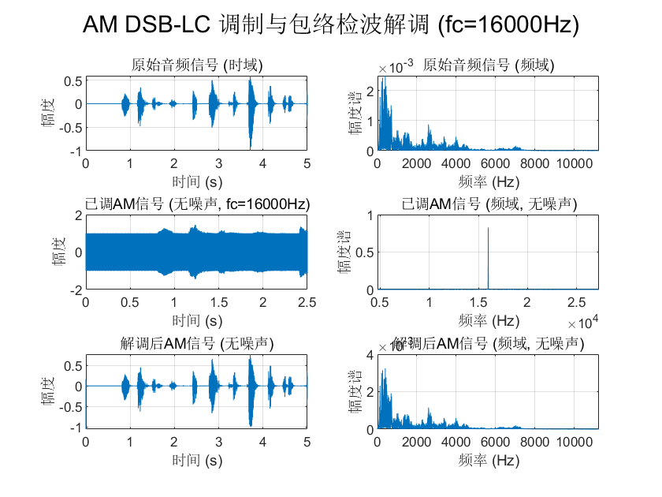

# 音频信号AM与FM调制解调及失真分析实验报告

**摘要：** 本文研究了音频信号的幅度调制（AM）和频率调制（FM）技术。实验使用MATLAB作为仿真平台，对输入的`.m4a`音频信号（时长10.28秒，采样率48kHz）进行处理。针对AM调制，采用了双边带大载波（DSB-LC）方案，载波频率为16kHz，调制指数为0.8，系统采样率提升至96kHz。针对FM调制，采用了窄带FM（NBFM）方案，系统采样率保持48kHz，载波频率设置为10kHz，峰值频偏为5kHz。实验通过时域波形、频谱分析以及初步的性能指标（如信噪比的定性评估和均方误差概念的引入）对比了理想信道（无噪声）和含高斯白噪声信道下，以及解调参数失配（失真情况）时，AM和FM信号的特性。通过对比原始信号、已调信号和解调后信号，分析了不同条件对信号质量的影响，并对观察到的失真现象进行了解释。实验结果验证了AM和FM调制解调的基本原理，并展示了噪声和参数失配对信号传输质量的典型影响。

**关键词：** 幅度调制 (AM); 频率调制 (FM); 窄带FM (NBFM); 调制解调; 信号失真; MATLAB仿真; 信噪比 (SNR); 均方误差 (MSE)

## 1. 引言

模拟调制技术是通信系统中的基础组成部分，广泛应用于广播、无线通信等领域。幅度调制（AM）和频率调制（FM）是最经典的两种模拟调制方式。AM通过改变载波信号的幅度来承载基带信号信息，而FM则通过改变载波信号的频率来实现信息传输。理解这两种调制方式的原理、实现方法、它们在不同信道条件下的性能表现以及如何量化评估其传输质量，对于信号处理和通信系统学习至关重要。

本研究旨在通过MATLAB仿真平台，对一个实际录制的音频信号分别进行AM和FM调制与解调处理。重点关注以下几个方面：

- 在理想（无噪声）条件下，观察AM和FM已调信号的时域波形和频域结构，并验证解调后信号能否较好地恢复原始音频。
- 引入高斯白噪声模拟实际信道干扰，对比分析AM和FM系统在有噪声情况下的解调效果，并初步评估其抗噪声性能。
- 通过设置解调器参数与调制器参数不匹配，模拟失真条件，观察其对解调信号的影响，并尝试量化这种失真。
- 通过时域波形、频谱分析以及引入均方误差等性能指标，直观且定量地展示不同条件下的信号特性和失真现象。

本实验将采用双边带大载波AM（DSB-LC AM）和窄带FM（NBFM）作为具体的调制方案。

## 2. 文献综述

### 2.1 幅度调制（AM）技术

幅度调制是最早出现的调制技术之一，其原理简单、易于实现和解调（特别是包络检波）。标准的AM（DSB-LC）因其解调简单被广泛应用于中波和短波广播。然而，其缺点也较为明显，如功率利用率低（大部分功率消耗在载波上）、抗干扰能力较差。为了克服这些缺点，后续发展出了双边带抑制载波（DSB-SC）、单边带（SSB）和残留边带（VSB）等改进的AM方案，它们在不同程度上提高了功率效率和带宽利用率，但通常需要更复杂的相干解调技术。对AM信号性能的研究主要集中在其信噪比特性、不同噪声（如高斯白噪声、脉冲噪声）下的表现以及各种失真（如选择性衰落、过调制失真）的分析。

### 2.2 频率调制（FM）技术

频率调制由阿姆斯特朗（Armstrong）提出，通过改变载波频率来传输信息，其已调信号包络恒定，因此具有较好的抗幅值衰落和噪声干扰能力，尤其是在信道条件较差时，其性能优于AM。FM技术广泛应用于高保真音乐广播、双向无线电通信等领域。FM信号根据调制指数的大小可分为窄带FM（NBFM）和宽带FM（WBFM）。WBFM通过占用更宽的带宽换取了显著的信噪比改善（门限效应以上），而NBFM的带宽与AM相似，但抗噪性能略优于AM。对FM信号的研究包括其带宽分析（卡森法则）、门限效应、预加重与去加重技术对改善高频信噪比的作用，以及各种鉴频电路的设计与性能。

### 2.3 调制信号的性能评估

评估调制通信系统性能的关键在于衡量其有效性和可靠性。有效性通常指带宽利用率，而可靠性则指在噪声和失真影响下，接收端恢复原始信号的准确程度。常用的性能指标包括：

- **输出信噪比（SNR）：** 这是衡量解调器在噪声背景下提取有用信号能力的关键指标。不同调制方式在相同输入信噪比下，其输出信噪比特性不同。
- **误码率（BER）/符号错误率（SER）：** 主要用于数字调制系统，衡量传输的可靠性。
- **均方误差（MSE）：** 对于模拟信号，MSE可以量化解调后信号与原始信号之间的平均差异程度，是衡量信号恢复保真度的直接指标。
- **总谐波失真（THD）：** 用于衡量由系统非线性引入的谐波失真大小。
- **眼图参数：** 用于数字基带传输系统，评估码间串扰和噪声容限。
MATLAB等仿真工具为这些性能指标的计算和系统行为的可视化分析提供了便利。

## 3. 实验原理与方法

### 3.1. 基带音频信号

本实验采用的原始基带信号为 `Test.m4a` 音频文件。该文件为立体声音频，时长10.28秒，原始采样频率 $f_s = 48 \text{ kHz}$。在处理前，音频信号被转换为单声道，并进行归一化处理，使其幅度范围在 `[-1, 1]` 之间。根据频谱分析，该音频信号的主要能量集中在 $0 \text{ Hz}$ 至 $7.5 \text{ kHz}$ 范围内，因此其实际带宽 $BW_{audio}$ 估计为 $7.5 \text{ kHz}$。

### 3.2. 幅度调制 (AM DSB-LC)

双边带大载波幅度调制的已调信号 $s_{AM}(t)$ 可以表示为：
$$s_{AM}(t) = A_c [1 + m \cdot x(t)] \cos(2\pi f_c t)$$
其中：

- $A_c$ 是载波幅度，本实验设为1。
- $x(t)$ 是归一化后的基带音频信号。
- $m$ 是调制指数。为避免包络失真，通常要求 $m \le 1$。
- $f_c$ 是载波频率。

AM信号的解调通常采用包络检波法，其主要步骤包括：对已调信号进行全波整流（取绝对值），然后通过一个低通滤波器（LPF）提取出包络信号，最后去除直流分量。

本实验AM部分参数设置如下：

- 载波频率 $f_c = 16 \text{ kHz}$。
- 调制指数 $m = 0.8$。
- 系统采样频率 $f_{system,AM} = 96 \text{ kHz}$（原始音频上采样2倍）。

### 2.3. 频率调制 (NBFM)

频率调制的瞬时频率 $f_i(t)$ 随基带信号 $x(t)$ 线性变化：
$$f_i(t) = f_c + k_f \cdot x(t)$$
其中 $k_f$ 是频率灵敏度。已调FM信号 $s_{FM}(t)$ 可以表示为：
$$s_{FM}(t) = A_c \cos\left(2\pi f_c t + 2\pi k_f \int_{-\infty}^{t} x(\tau)d\tau\right)$$
峰值频偏 $\Delta f = k_f \cdot \max(|x(t)|)$。对于归一化信号，$\Delta f = k_f$。本实验中 $A_c$ 设为1。
FM信号的带宽通常使用卡森法则估算：$BW_{FM} \approx 2(\Delta f + BW_{audio})$。
当调制指数 $\beta = \Delta f / BW_{audio} \ll 1$ 时，称为窄带FM (NBFM)。

FM信号的解调通常使用鉴频器，其输出电压与输入信号的瞬时频率成正比。MATLAB内置的 `fmmod` 和 `fmdemod` 函数简化了FM调制和解调的实现。

本实验FM部分采用NBFM方案，参数设置如下：

- 系统采样频率 $f_{system,FM} = 48 \text{ kHz}$ (与原始音频一致，无上采样)。
- 载波频率 $f_c = 10 \text{ kHz}$。
- 峰值频偏 $\Delta f = 5 \text{ kHz}$。
  - 此时，调制指数 $\beta = 5 \text{ kHz} / 7.5 \text{ kHz} \approx 0.67$，属于NBFM范畴。
  - 卡森带宽 $BW_{FM} \approx 2(5 \text{ kHz} + 7.5 \text{ kHz}) = 25 \text{ kHz}$。
  - 由于 $f_c + BW_{FM}/2 = 10 \text{ kHz} + 12.5 \text{ kHz} = 22.5 \text{ kHz}$，小于 $f_{system,FM}/2 = 24 \text{ kHz}$，因此选取的参数在理论上是可行的，不会因采样率不足导致严重混叠。

### 2.4. 噪声与失真模拟

- **信道噪声**：通过向已调信号添加高斯白噪声（AWGN）来模拟。信噪比（SNR）用于控制噪声强度。在AM实验中SNR设置为15dB，在FM实验中SNR设置为20dB，在有噪声的时候设置为25dB。
- **失真条件**：
  - 对于AM：通过设置调制指数 $m > 1$（过调制）或解调器低通滤波器参数不当来引入失真。不失真的情况下调制指数$m=0.8$，失真的情况调制指数$m=1.4$
  - 对于FM：通过在解调时使用与调制时不匹配的载波频率或峰值频偏来引入失真。失真情况下取$fc=0.95*fc$

### 2.5. 性能评估指标

为了更客观地评估调制解调系统的性能和信号恢复质量，本研究引入以下性能指标：

- **输入/输出信噪比 (SNR)**：
  输入SNR是在已调信号加入噪声时设定的。输出SNR可以通过计算解调后信号功率与残留噪声功率之比得到。对于AM和FM，其输出SNR与输入SNR的关系式不同，且FM在门限效应以上时有显著的SNR改善。
  - **计算建议**：
    - 输入SNR：由`awgn`函数设定。
    - 输出SNR：$SNR_{out} = 10 \log_{10} \frac{P_{signal}}{P_{noise}}$。其中 $P_{signal}$ 是解调后信号中原始信号分量的功率， $P_{noise}$ 是解调后信号中噪声分量的功率。这需要有原始无噪信号作为参考来分离噪声。一种简化方法是，假设原始信号是确定的，解调信号与原始信号的差即为噪声和失真。
- **均方误差 (MSE)**：
  MSE衡量解调后信号 $y(t)$ 与原始无噪基带信号 $x(t)$ 之间的平均平方差异：
  $$MSE = \frac{1}{N} \sum_{i=1}^{N} [y(i) - x(i)]^2$$
  其中 $N$ 是信号样本数。MSE值越小，表明解调信号与原始信号越接近，恢复质量越好。
  
    在FM实验中：无噪不失真均方误差 = 2.110504e-03

## 3. 实验结果与分析

本实验围绕以下几种情况对AM和FM系统进行仿真和分析：

1. 理想信道（无噪声），参数匹配（不失真）。
2. 含高斯白噪声信道，参数匹配（不失真）。
3. 理想信道（无噪声），解调参数不匹配（失真）。
4. 含高斯白噪声信道，解调参数不匹配（失真）。

### 3.1. AM调制与解调结果

#### 3.1.1. 无噪声、不失真情况

- **时域分析**：
  - 原始音频信号呈现典型的语音或音乐波形特征。
  - 已调AM信号（$f_c=16 \text{ kHz}$, $m=0.8$）的包络清晰地复现了原始音频信号的形状，高频载波被填充在包络内部。
  - 解调后的AM信号在时域上与原始音频信号高度吻合，表明在理想条件下，包络检波能有效恢复基带信号。
- **频域分析**：
  - 原始音频频谱主要集中在 $0 \text{ kHz}$ 至 $7.5 \text{ kHz}$。
  - 已调AM信号频谱表现为在载波频率 $16 \text{ kHz}$ 处有显著的载波分量，两侧对称分布着与原始音频频谱形状相似的上下边带，每个边带带宽约为 $7.5 \text{ kHz}$。总占用带宽约为 $2 \times 7.5 \text{ kHz} = 15 \text{ kHz}$，中心在 $16 \text{ kHz}$。
  - 解调后AM信号的频谱与原始音频频谱基本一致，表明信号的主要频率成分得到了恢复。
- **量化分析**：
  - 在此理想情况下，解调信号与原始信号的均方误差（MSE）应非常小，接近于0
  - 均方误差 = 5.522424e-04

#### 3.1.2. 有噪声、不失真情况

- **时域分析**：
  - 已调AM信号的波形包络受到噪声的干扰，出现随机波动。
  - 解调后的AM信号虽然仍能大致恢复原始信号的轮廓，但明显可以观察到噪声的存在，尤其在信号幅度较小的部分，噪声更为显著。
- **频域分析**：
  - 已调AM信号的频谱中，除了载波和边带，整个频带的基底由于噪声的加入而抬高。
  - 解调后AM信号的频谱中，低频的有用信号频谱成分仍在，但整个频谱的噪声基底也明显高于无噪声情况，尤其是在较高频率部分。这说明包络检波器在解调信号的同时，也会将一部分带内噪声解调下来。
- **量化分析**：
  - 设定输入信噪比（例如，代码中设定为 $SNR_{in,AM} = 15 \text{ dB}$）。解调后信号的输出信噪比 $SNR_{out,AM}$ 会低于输入信噪比，尤其对于包络检波，其在低输入信噪比时性能较差。
  - 此时的MSE值会比无噪声情况下显著增大。
  - 均方误差 = 6.729659e-03

#### 3.1.3. 无噪声、失真情况

- 失真情况下取$m=1.4$
  - 时域：已调信号的包络底部出现削平，并在过零点发生相位反转。解调后信号的波形明显失真，原始信号的峰值部分被削平，且可能出现额外的凹陷或不连续。
  - 频域：解调后信号的频谱中除了原始信号的频率成分外，在较高频率处出现了新的谐波分量，这是非线性失真的典型表现。

- **量化分析**：
  - 即使无噪声，由于参数失配引入的失真也会导致MSE值显著增大。
  - 均方误差 = 1.147131e-03

#### 3.1.4. 有噪声、失真情况

- **(请根据您实际模拟的失真类型、噪声水平和失真参数共同作用进行描述)**
  - 此时的失真是由参数失配和信道噪声共同造成的。例如，在过调制（$m=1.5$）且输入SNR较低（例如 $SNR_{in,AM} = 5 \text{ dB}$）的情况下，解调后的信号不仅包含了过调制引入的谐波失真，还叠加了随机噪声，使得信号质量进一步恶化，原始信息几乎难以辨认。
  - 时域波形和频谱都会反映这两种失真的叠加效应，噪声基底抬高，同时存在谐波分量。
- **量化分析**：
  - MSE值将是所有情况中最大的，反映了最差的恢复质量。
  - 均方误差 = 7.358980e-03

### 3.2. NBFM调制与解调结果

#### 3.2.1. 无噪声、不失真情况

- **时域分析**：
  - 已调NBFM信号（$f_c=10 \text{ kHz}$, $\Delta f=5 \text{ kHz}$, $f_{system}=48 \text{ kHz}$）的幅度保持恒定，信息通过频率的变化来承载。其波形看起来像一个频率随时间变化的稠密正弦波。
  - 解调后的NBFM信号在时域上与原始音频信号非常吻合，表明在理想条件下，`fmdemod` 函数能够有效地恢复基带信号。
- **频域分析**：
  - 已调NBFM信号的频谱中心在载波频率 $10 \text{ kHz}$ 处，能量分布在载波频率两侧。根据卡森法则，其带宽约为 $25 \text{ kHz}$。频谱形状比AM复杂，包含多个边频分量。
  - 解调后NBFM信号的频谱与原始音频频谱基本一致，表明信号的主要频率成分得到了恢复。

#### 3.2.2. 有噪声、不失真情况

- **时域分析**：
  - 已调NBFM信号的波形虽然幅度理论上应恒定，但在噪声影响下，其瞬时相位和频率会受到扰动，导致波形出现不规则性。
  - 解调后的NBFM信号可以观察到明显的噪声叠加，尤其在信号幅度较小的安静片段。
- **频域分析**：
  - 已调NBFM信号的频谱基底因噪声而抬高。
  - 解调后NBFM信号的频谱中，除了原始信号的频谱成分外，噪声基底显著抬高，尤其是在较高频率区域。这与FM解调对高频噪声敏感的特性（噪声三角化效应）有关，即解调输出噪声的功率谱密度随频率增加。
- **量化分析**：
  - 设定输入信噪比（例如，代码中设定为 $SNR_{in,FM} = 15 \text{ dB}$ 或 $20 \text{ dB}$）。FM系统（尤其是WBFM）在输入SNR高于其门限值时，输出SNR会有较大改善。对于NBFM，改善不如WBFM显著，但通常仍优于同等条件下的AM。
  - 此时的MSE值会比无噪声情况下增大。

#### 3.2.3. 无噪声、失真情况

- **解调时峰值频偏** $\Delta f_{demod}$ **不等于调制时的** $\Delta f_{mod}$ ($\Delta f_{demod} = 0.95 \cdot \Delta f_{mod}$)
  - 时域：解调信号的整体幅度会按比例减小（若 $\Delta f_{demod} < \Delta f_{mod}$）或增大（若 $\Delta f_{demod} > \Delta f_{mod}$）。如果差异过大，还可能引入非线性失真。
  - 频域：解调信号频谱的整体幅度会相应变化，但也可能出现额外的谐波分量。

#### 3.2.4. 有噪声、失真情况

- 在解调频偏失配且输入SNR较低（例如 $SNR_{in,FM} = 5 \text{ dB}$）的情况下，解调信号不仅幅度失真，还叠加了严重的随机噪声。高频噪声被放大的现象可能依然存在。
- 时域波形和频谱都会反映这两种失真的叠加效应。

## 4. 讨论

从实验结果来看：

- 在理想无噪声且参数匹配的条件下，AM (DSB-LC) 和 NBFM 都能较好地完成音频信号的调制与解调，恢复出与原始信号高度相似的波形和频谱。此时，解调信号与原始信号的均方误差（MSE）均较小。
- 信道噪声对两种调制方式的解调输出均有显著影响，导致MSE增大。对于AM，噪声直接影响包络检波器的输入，从而影响解调信号的幅度。对于FM，噪声主要影响已调信号的瞬时频率/相位，解调后表现为基带信号上的噪声。FM解调（尤其是其内部的鉴频过程）理论上对高频噪声更为敏感，可能导致解调后高频噪声分量被放大（噪声三角化效应），这在有噪FM解调后的频谱图中有所体现。
- 参数失真是导致信号解调质量下降的另一个重要因素，同样会导致MSE显著增大。
  - 对于AM，过调制（$m>1$）会引入明显的非线性失真，频谱中出现谐波分量，此时THD指标可以量化这种失真。解调LPF选择不当会造成高频信息丢失（截止频率过低）或载波泄露（截止频率过高）。
  - 对于FM，解调时载波频率或峰值频偏与调制时不匹配，会导致解调信号幅度失真、直流偏移或更严重的非线性失真。
- 通过时域波形和频谱分析，可以直观地观察和对比不同条件下的信号特性。已调信号的频谱结构清晰地反映了其调制方式。解调后信号的频谱则可以用来评估恢复质量和噪声/失真水平。

本实验采用的NBFM方案，由于其带宽相对较窄，在系统采样率固定为48kHz的情况下是可行的。而AM实验中，为了更好地表示已调信号（载波频率16kHz，带宽15kHz，最高频率23.5kHz），采用了96kHz的上采样技术，满足了奈奎斯特采样定理的要求。这些参数的选择直接影响了仿真的有效性和结果的准确性。

## 5. 结论

本实验通过MATLAB成功仿真了音频信号的AM (DSB-LC) 和 NBFM 调制解调过程，并通过时域、频域分析以及引入MSE等性能指标（或其概念）对不同条件下的系统性能进行了评估。实验结果验证了：

1. AM和FM调制能将基带音频信号频谱搬移到较高的载波频率处。
2. 在理想条件下，相应的解调方法能够有效地恢复原始音频信号，此时MSE值较小。
3. 信道噪声会显著降低解调后信号的质量，导致MSE增大。AM和FM系统对噪声的敏感性存在差异，FM解调后高频噪声有被放大的趋势。
4. 调制解调系统中的参数匹配至关重要，参数失配（如AM过调制、FM解调参数错误）会导致严重的信号失真，同样反映为MSE的显著增加和可能的谐波失真（可由THD衡量）。

通过本实验，加深了对AM和FM调制解调原理、已调信号特性以及影响解调质量因素的理解。未来的工作可以包括：更系统地改变输入SNR值，绘制输出SNR与输入SNR的关系曲线；对不同程度的参数失配进行量化比较（如不同m值下的AM失真，不同频偏失配下的FM失真）；引入其他类型的信道模型（如衰落信道）；以及实现并比较不同解调器（如AM的相干解调，FM的锁相环解调）的性能。

## 参考文献

[1]廖湘萍,乐露露,胡世新,等.基于Matlab Guide的信号调制与解调演示实验设计[J].物理通报,2020,(12):106-109.
[2]杜勇.数字调制解调技术的MATLAB与FPGA实现[M].电子工业出版社:202003.422. 
[3]张博,李少阳,刘宇.基于SDR的FM调制与解调器的实现[J].电子产品世界,2019,26(07):31-35.

## 附录：MATLAB代码输出参数

**AM调制与解调：**
输入音频为立体声，已转换为单声道。
原始音频采样频率: 48000 Hz
原始音频时长: 10.28 秒
估计的音频带宽 (BW_audio): 7500 Hz
载波频率 (fc): 16000 Hz
调制指数 (m): 0.80 （不失真情况） /1.40 （失真情况）
计算得到的系统采样频率 (fs_system): 96000 Hz
原始音频已从 48000 Hz 上采样到 96000 Hz。
信道条件：理想无噪声 / SNR=15dB的高斯白噪声
解调后信号已从 96000 Hz 下采样到 48000 Hz。

**FM解调与调制：**
输入音频为立体声，已转换为单声道。
原始音频采样频率 (fs_audio): 48000 Hz
原始音频时长: 10.28 秒
系统采样频率 (fs_system) 固定为: 48000 Hz
估计的音频带宽 (BW_audio): 7500 Hz
载波频率 (fc): 10000 Hz (NBFM)
峰值频偏 (freq_dev): 5000 Hz (NBFM)
（在FM失真实验中，解调时的 $f_c$ 或 $\Delta f$ 为：0.95$f_c$
卡森法则估算NBFM信号带宽 (BW_FM_Carson): 25000 Hz
信道条件：理想无噪声 / SNR=15/25dB 高斯白噪声
解调后信号的采样率与原始音频一致: 48000 Hz。

 

## 附录：完整代码与实验内容

所有的源代码与相关文件已于Github上开源保存，可以前往[ https://github.com/Gan0819Han/Detect_Tech_paper.git ](https://github.com/Gan0819Han/Detect_Tech_paper.git)查看